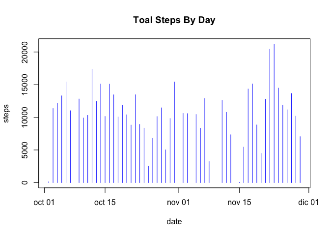
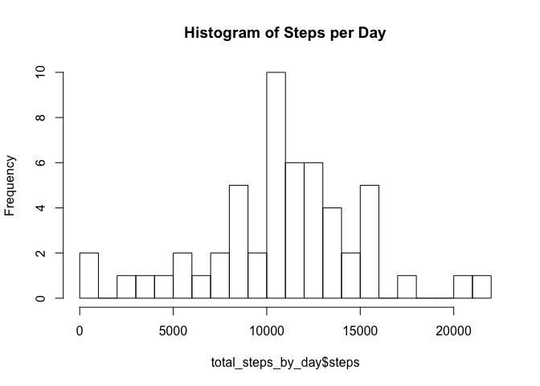
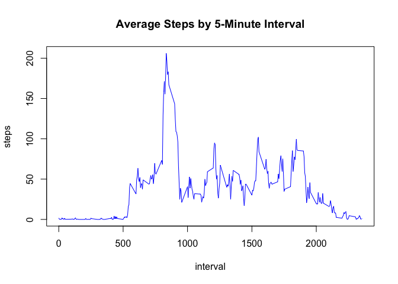
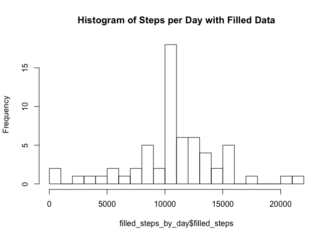
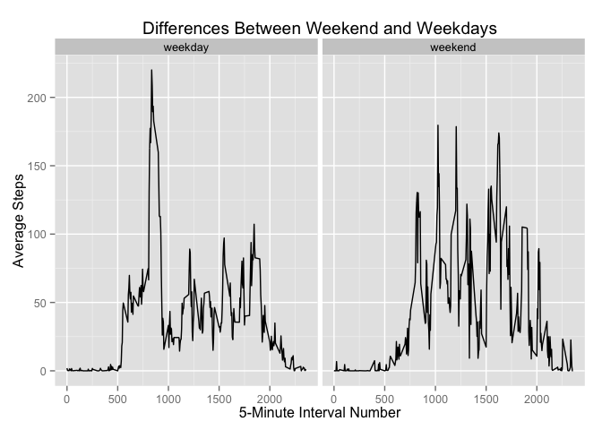

# Reproducible Research: Peer Assessment 1

It is now possible to collect a large amount of data about personal
movement using activity monitoring devices such as a
[Fitbit](http://www.fitbit.com), [Nike
Fuelband](http://www.nike.com/us/en_us/c/nikeplus-fuelband), or
[Jawbone Up](https://jawbone.com/up). These type of devices are part of
the "quantified self" movement -- a group of enthusiasts who take
measurements about themselves regularly to improve their health, to
find patterns in their behavior, or because they are tech geeks. But
these data remain under-utilized both because the raw data are hard to
obtain and there is a lack of statistical methods and software for
processing and interpreting the data.

This assignment makes use of data from a personal activity monitoring
device. This device collects data at 5 minute intervals through out the
day. The data consists of two months of data from an anonymous
individual collected during the months of October and November, 2012
and include the number of steps taken in 5 minute intervals each day.

## Data

The data for this assignment can be downloaded from the course web
site:

* Dataset: [Activity monitoring data](https://d396qusza40orc.cloudfront.net/repdata%2Fdata%2Factivity.zip) [52K]

The variables included in this dataset are:

* **steps**: Number of steps taking in a 5-minute interval (missing
    values are coded as `NA`)

* **date**: The date on which the measurement was taken in YYYY-MM-DD
    format

* **interval**: Identifier for the 5-minute interval in which
    measurement was taken


The dataset is stored in a comma-separated-value (CSV) file and there
are a total of 17,568 observations in this
dataset.

## Required Libraries

Required lib used in the last point.


```r
library(ggplot2)
```

## Loading and preprocessing the data

**REQUERIMENTS**  

1. Load the data 
2. Process/transform the data (if necessary) into a format suitable for your analysis

-----------------------


```r
in_data = read.csv("./activity.csv", stringsAsFactors = FALSE)
in_data$date = as.Date(in_data$date, format = "%Y-%m-%d")
```


## What is mean total number of steps taken per day?

**REQUERIMENTS**

1. Make a histogram of the total number of steps taken each day
2. Calculate and report the mean and median total number of steps taken per day

-----------------------


**1.**
Calculate and plot: total number of steps per day.
Missing values: ignored by using "na.rm = TRUE"
For days where all the data is NA, it will return NA for both mean and median.


```r
total_steps_by_day = aggregate(steps ~ date, data = in_data, sum, na.rm=TRUE)
plot(total_steps_by_day, type="h", main="Toal Steps By Day", col="blue")
```

 

**2.**
Calculate: mean and median for the number of steps per day.


```r
mean_steps_by_day = mean(total_steps_by_day$steps)
median_steps_day = median(total_steps_by_day$steps)
hist(total_steps_by_day$steps, breaks=20, main="Histogram of Steps per Day")
```

 

```r
sprintf("Number of steps taken each day > Mean   = , %.1f",mean_steps_by_day)
```

```
## [1] "Number of steps taken each day > Mean   = , 10766.2"
```

```r
sprintf("Number of steps taken each day > Median = , %.1f",median_steps_day)
```

```
## [1] "Number of steps taken each day > Median = , 10765.0"
```


## What is the average daily activity pattern?

**REQUERIMENTS**

1. Make a time series plot (i.e. type = "l") of the 5-minute interval (x-axis) and the average number of steps taken, averaged across all days (y-axis).
2. Which 5-minute interval, on average across all the days in the dataset, contains the maximum number of steps?

-----------------------

**1.**
Calculate the average number of steps by time interval, then plot the graph.


```r
average_steps_interval = aggregate(steps ~ interval, data=in_data, mean)
plot(average_steps_interval, type = "l", main = "Average Steps by 5-Minute Interval", col = "blue")
```

 

**2.**
Finding the 5-minute interval, on average across all the days in the dataset, that contains the maximum number of steps.


```r
average_steps_interval[which.max(average_steps_interval$steps),]
```

```
##     interval    steps
## 104      835 206.1698
```


## Imputing missing values

**REQUERIMENTS**

1. Calculate and report the total number of missing values in the dataset (i.e. the total number of rows with NAs)   
2. Devise a strategy for filling in all of the missing values in the dataset. The strategy does not need to be sophisticated. For example, you could use the mean/median for that day, or the mean for that 5-minute interval, etc    
3. Create a new dataset that is equal to the original dataset but with the missing data filled in.
4. Make a histogram of the total number of steps taken each day and Calculate and report the mean and median total number of steps taken per day. Do these values differ from the estimates from the first part of the assignment?  What is the impact of imputing missing data on the estimates of the total daily number of steps?

-----------------------

Number of rows with steps = NA

```r
sum(is.na(in_data$steps))
```

```
## [1] 2304
```

```r
merged_data = merge(in_data, average_steps_interval, by="interval")
names(merged_data) = c("interval", "original_steps", "date", "average_steps")
merged_data$filled_steps = ifelse(is.na(merged_data$original_steps), merged_data$average_steps, merged_data$original_steps)
```

Checking total number of steps by day

```r
filled_steps_by_day <- aggregate(filled_steps ~ date, data=merged_data, sum)
```


```r
mean(filled_steps_by_day$filled_steps)
```

```
## [1] 10766.19
```

```r
median(filled_steps_by_day$filled_steps)
```

```
## [1] 10766.19
```

```r
hist(filled_steps_by_day$filled_steps, breaks=20, main="Histogram of Steps per Day with Filled Data")
```

 


## Are there differences in activity patterns between weekdays and weekends?


**REQUERIMENTS**

1. Create a new factor variable in the dataset with two levels -- "weekday" and "weekend" indicating whether a givendate is a weekday or weekend day. 
2. Make a panel plot containing a time series plot (i.e. type = "l") of the 5-minute interval (x-axis) and the average number of steps taken, averaged across all weekday days or weekend days (y-axis). The plot should look something like the following, which was created using simulated data

-----------------------

**1.**

Adding new column with the name "day_of_week" to "merged_data" dataset.   
We´re using **weekdays()** base package function to extract day of week name for each readed "date" variable.   
 

```r
merged_data$day_of_week = weekdays(as.Date(merged_data$date))
```

Creating a "weekend" variable by comparing weekend literal values assigned by weekdays() function.   
In this case I´m using ES (Spain) locale, so returned literal values are "sabado" and "domingo".   
I'm also taking into account "saturday" and "sunday" literal for other locales.


```r
merged_data$weekend = as.factor(ifelse(merged_data$day_of_week %in% c("sabado", "domingo","saturday","sunday"), "weekend", "weekday"))
weekend_data = aggregate(filled_steps ~ interval + weekend, data=merged_data, mean)
```

**2.**

Plotting graph differences using **ggplot2** system.

```r
ggplot(weekend_data,aes(interval,filled_steps)) + 
  geom_line() + 
  facet_grid(.~weekend) + 
  labs(title = "Differences Between Weekend and Weekdays") + 
  labs(x = "5-Minute Interval Number", y = "Average Steps")
```

 

We can see weekday steps are similar to the weekend steps.   
The early morning weekday peak activity is lower than during a weekend and the overall weekend activity during the day is higher than during the week.

